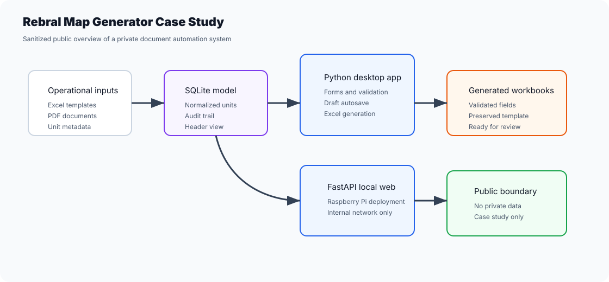
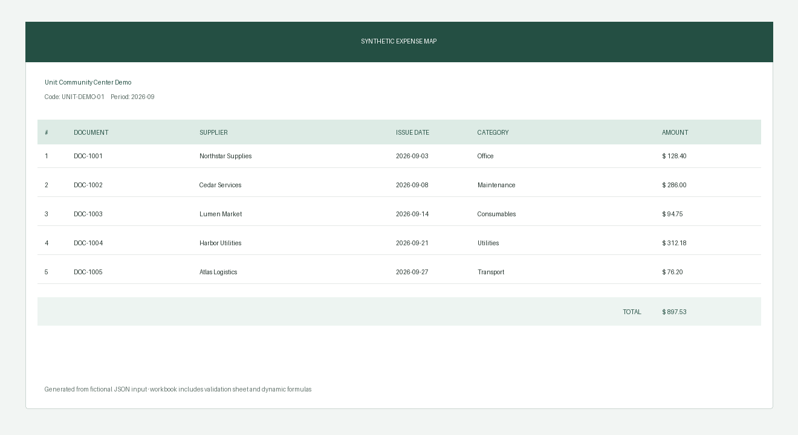

# Rebral Map Generator Case Study

Public, sanitized case study for a private Python document automation system.





The real repository stays private because it contains operational documents, databases, fiscal files and organization-specific context. This public repo exists to show the engineering work without exposing private data.

## What The Private System Does

- Organizes repeated unit metadata in SQLite.
- Fills official spreadsheet templates without breaking layout.
- Extracts data from PDFs with OCR fallback for scanned files.
- Provides a desktop workflow for review, validation and draft recovery.
- Includes a local FastAPI web version for Raspberry Pi/internal network use.
- Generates spreadsheets for human review and delivery.

## What This Public Repo Contains

- A runnable JSON-to-XLSX generator with dynamic rows and formulas.
- A synthetic five-document example and generated visual preview.
- Automated checks for workbook sheets, filters, formulas and broken references.
- Sanitized architecture.
- Case study narrative.
- Safety boundary.
- Notes on what could be reused in a generic public demo.
- CI check that blocks private data file formats.

Read the full case study: [docs/case-study.md](docs/case-study.md).

## Run the public demo

```bash
python -m pip install -e ".[dev]"
python -m map_demo.cli examples/synthetic-map.json outputs/demo-map.xlsx --preview outputs/demo-preview.png
pytest -q
```

Generated spreadsheets remain ignored by Git. The committed input and preview use only invented
units, suppliers, references and amounts.
